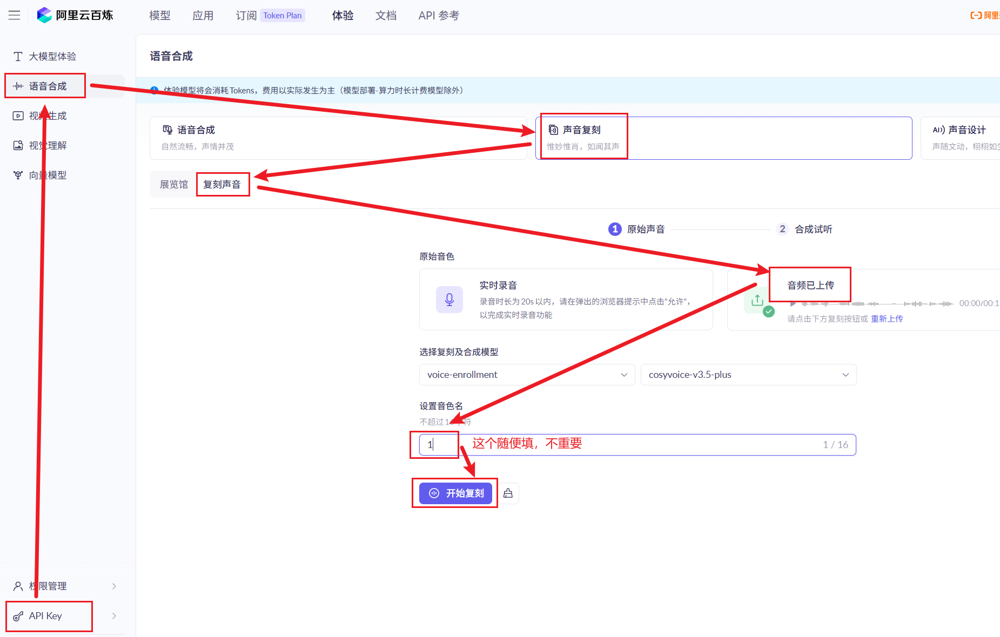
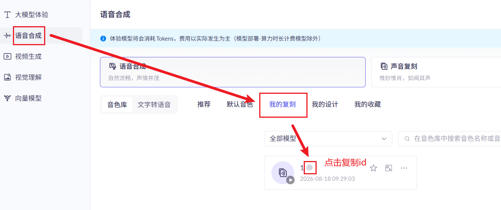

# 文本转语音（文生音频）使用说明

本工具用**你自己的阿里云百炼 API Key**，把文本合成为你**上传的参考音色**的专属音色的语音。
每次调用按量计费，**token 消耗费用自负**（复刻免费，合成约 0.8~1.5 元/万字符，一句短话几厘钱）。

## 需要的东西（2 个文件）

- `tts_api.py` — 工具脚本（任意 Python 3 可运行，无需安装任何依赖）
- `reference.wav` — 参考音频（音色来源，可替换成其他音频换音色）

## 第一步：拿到你自己的 API Key（一次性，约 5 分钟）

1. 点击链接https://www.aliyun.com/product/bailian 点击"立即体验Qwen3.8"按钮，并注册/登录阿里云。
2. 进入 **获取API Key** 页面，点击左下角点「创建 API Key」，点图标**复制** Key。（`sk-` 开头，务必不要泄露）
3. 点击“语音合成” -> "声音复刻" -> "复刻声音"，上传 `reference.wav`或者自选参考音频（录音时长为20s以内），创建专属音色。
4. 点击"语音合成" -> "我的复刻" -> "复制音色id"。
## 第二步：配置 Key

用记事本打开 `tts_api.py`，找到顶部配置区，把 Key 填进 `API_KEY` 这一行：

```python
API_KEY = '你的Key'
VOICE_NAME = '你的音色id'
``` 

## 第三步：运行

```
python tts_api.py "要合成的文本"
```

或交互式（会提示你输入文本）：

```
python tts_api.py
```

或直接指定文本文件（支持中文路径）：

```
python tts_api.py 我的文本.txt
```

第一次运行会自动上传 `reference.wav` 并为你创建专属音色（只需几秒），之后自动复用。
生成的音频在插件 `sounds/generated/` 目录下，文件名形如 `api_20260818_xxxxxx.wav`。

## 常用设置（可选）

| 配置项 | 默认 | 说明 |
|---|---|---|
| `MODEL` | `cosyvoice-v3.5-flash` | 合成模型，音质更好可选 `cosyvoice-v3.5-plus`（更贵） |
| `REFERENCE_WAV` | `reference.wav` | 参考音频路径，换音色就改这里 |
| `TRIM_TAIL_SEC` | `0` | 若音频结尾有"滴"声，设 `0.3` 裁掉末尾 |

## 常见问题

- **报错 400/418**：音色没创建成功或模型不一致。删除同目录的 `api_voice_id.txt` 后重跑一次即可（会重新创建音色）。
- **结尾有"滴"声**：把 `TRIM_TAIL_SEC` 改为 `0.3`。
- **网络上传失败**（`上传失败: tmpfiles.org...`）：国内网络连不上国外图床，请把 `reference.wav` 用你已有的阿里云 OSS 上传并配置脚本里的 `OSS_*` 四项（见脚本内注释）。

## 注意

- API Key 是你自己的敏感凭证，**不要把脚本文件发给无关人员**，泄露后去百炼控制台删除重建。
- 参考音频来自游戏《明日方舟》角色语音，请勿用于商用或公开传播。
